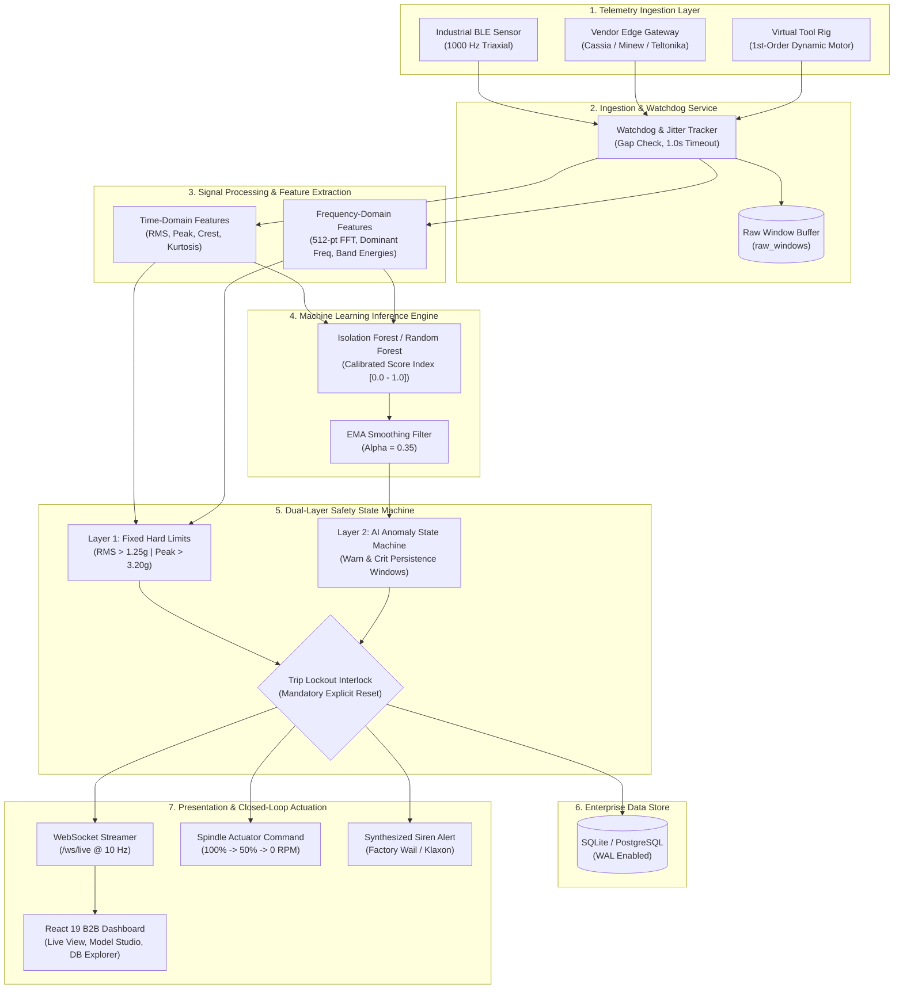
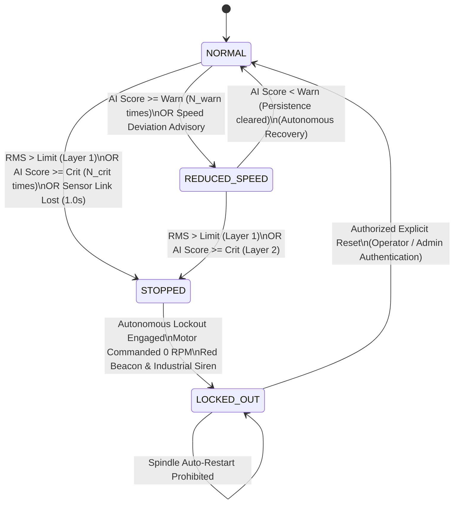
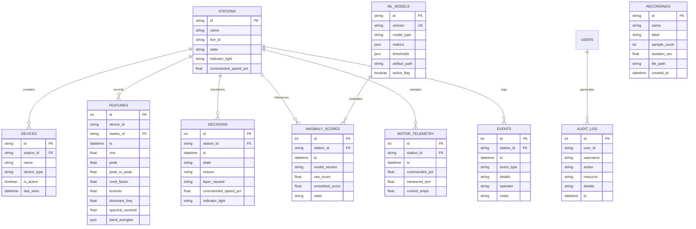

# Automotive Assembly Tool Monitoring: Complete Technical Documentation & Architecture Specification

---

## 1. Executive Summary & System Purpose

In high-volume automotive powertrain and chassis manufacturing, threaded fastening operations performed by DC electric nutrunners and multi-spindle tightening stations are critical to vehicle structural integrity and passenger safety. Subtle mechanical deviations—such as bearing raceway spalling, spindle imbalance, gearbox backlash, or socket misalignments—frequently precede catastrophic tool lockouts, defective joint torque-angle curves, and costly unplanned line stoppages.

**Aperture Automotive Assembly Tool Monitoring** is an enterprise-grade, hardware-agnostic edge artificial intelligence and closed-loop machine protection platform. The system continuously ingests high-rate (1,000 Hz) tri-axial vibration telemetry from industrial Bluetooth Low Energy (BLE) sensor pucks or field gateways, computes physics-informed spectral and statistical features, infers predictive anomaly probabilities using calibrated machine learning models, and executes deterministic safety trips via an autonomous dual-layer decision engine.

```
+----------------------------------------------------------------------------------------------------+
|                                    KEY SYSTEM OBJECTIVES                                           |
+----------------------------------------------------------------------------------------------------+
| 1. Sub-50ms Edge Feature Extraction & FFT Spectral Decomposition                                  |
| 2. Calibrated [0.00 - 1.00] Machine Learning Anomaly Scoring                                      |
| 3. Dual-Layer Protection: Deterministic Hard Limits Layer + AI Predictive State Machine            |
| 4. Closed-Loop Machine Actuation: 100% Nominal -> 50% Throttle -> 0 RPM Lockout                    |
| 5. Mandatory Operator Explicit Reset with Cryptographic Audit Trail                                |
| 6. Complete Real-Time Database Explorer & Gold-Standard Dataset Session Recorder                   |
+----------------------------------------------------------------------------------------------------+
```

---

## 2. High-Level Architecture & End-to-End Pipeline

The platform follows a decoupled, low-latency edge pipeline that accepts telemetry from physical hardware nodes, vendor IoT gateways, or the integrated virtual motor rig.



---

## 3. Data Contract & Ingestion Protocol

The ingestion engine is hardware-agnostic, accepting standardized JSON packets whether transmitted directly from embedded firmware over HTTP/MQTT or forwarded via gateway microservices.

### 3.1 Standard Ingestion Schema

```json
{
  "device_id": "AC:23:3F:88:D1:05",
  "station_id": "station-A",
  "seq": 10428,
  "sample_rate_hz": 1000,
  "axes": "xyz",
  "window": [
    0.112, 0.125, 0.108, 0.098, 0.142, 0.138, 0.120, 0.115,
    0.109, 0.118, 0.130, 0.124, 0.116, 0.112, 0.128, 0.132
  ],
  "features": {
    "rms": 0.124,
    "peak": 0.285,
    "peak_to_peak": 0.556,
    "crest_factor": 2.298,
    "kurtosis": 2.84,
    "dominant_freq": 50.0,
    "spectral_centroid": 52.5
  },
  "motor": {
    "measured_rpm": 2985.0,
    "commanded_pct": 100.0,
    "current_amps": 4.15
  },
  "status": "RUNNING",
  "temperature": 27.2,
  "battery_pct": 98.0
}
```

### 3.2 Ingestion Watchdog & Communication Interlocks

Industrial assembly lines cannot tolerate silent sensor disconnects or dropped packets that mask developing mechanical faults:
1. **Sequence Gap Detection**: Every incoming frame increments `seq`. Gaps $\Delta seq > 1$ increment packet loss counters and trip diagnostic telemetry.
2. **Watchdog Dropout Timer**: If no packet arrives for `1.0 second`, the watchdog triggers an autonomous safety interlock (`state = STOPPED`, `layer_caused = LINK_LOST`).
3. **Data Rolling Retention**: High-frequency raw buffers are rolling-pruned to a configurable max depth (default 3,000 records) to preserve disk I/O while permanent logs and model checkpoints are protected.

---

## 4. Mathematics of Feature Extraction

Incoming time-series windows containing $N = 100$ to $1000$ accelerometer readings $x[n]$ are processed through statistical and Fourier transforms in $< 50\text{ ms}$.

```
Raw Accelerometer Buffer x[n]
   │
   ├── Time-Domain Analysis
   │     ├── Root Mean Square (RMS):     x_rms = sqrt( (1/N) * Σ (x[n])^2 )
   │     ├── Peak Acceleration:          x_peak = max(|x[n]|)
   │     ├── Crest Factor:               CF = x_peak / x_rms
   │     ├── Kurtosis:                   Kurt = (1/N) * Σ ((x[n] - μ) / σ)^4
   │     └── Skewness:                   Skew = (1/N) * Σ ((x[n] - μ) / σ)^3
   │
   └── Frequency-Domain Analysis (512-point FFT)
         ├── Discrete Fourier Transform: X[k] = Σ x[n] * e^(-j*2π*k*n / N)
         ├── Power Spectrum Density:     P[k] = |X[k]|^2 / N
         ├── Dominant Frequency:         f_dom = argmax(P[k]) * (f_s / N_fft)
         ├── Spectral Centroid:          f_c = Σ (f_k * P[k]) / Σ P[k]
         └── Band Energy Integrals:      E_band = Σ P[k]  for k ∈ [f_low, f_high]
```

### Vibration Band Partitioning
- **Sub-synchronous band ($10\text{ Hz} - 40\text{ Hz}$)**: Identifies oil whirl, belt slip, and structural looseness.
- **1X Running Speed band ($45\text{ Hz} - 55\text{ Hz}$)**: Identifies mass unbalance.
- **2X Harmonic band ($90\text{ Hz} - 110\text{ Hz}$)**: Identifies shaft angular or parallel misalignment.
- **High-Frequency Exciter band ($150\text{ Hz} - 500\text{ Hz}$)**: Captures bearing raceway defect frequencies (BPFO, BPFI) and gear mesh impact resonance.

---

## 5. Machine Learning Anomaly Detection Architecture

```mermaid
graph LR
    subgraph Inputs
        F1["RMS (g)"]
        F2["Peak (g)"]
        F3["Crest Factor"]
        F4["Kurtosis"]
        F5["Dominant Freq (Hz)"]
        F6["Band Energies"]
    end

    subgraph Normalization
        SS["StandardScaler\n(μ, σ normalization)"]
    end

    subgraph Core_Model
        IF["Isolation Forest Ensemble\n(100 iTrees, Contamination = 0.05)"]
    end

    subgraph Calibration
        CAL["MinMax Sigmoidal Calibration\nRaw Score -> Probability [0.00 - 1.00]"]
        EMA["Exponential Moving Average Filter\nS_t = 0.35 * s_t + 0.65 * S_{t-1}"]
    end

    subgraph Outputs
        SCORE["Calibrated Smoothed Score\n(Nominal < 0.45 | Warn >= 0.45 | Crit >= 0.70)"]
    end

    Inputs --> SS
    SS --> IF
    IF --> CAL
    CAL --> EMA
    EMA --> SCORE
```



### Model Characteristics
- **Algorithm**: Multi-tree Isolation Forest with decision path length scoring. Anomaly score $s(x, n) = 2^{-\frac{E(h(x))}{c(n)}}$.
- **Calibration Engine**: Raw anomaly indices are fitted through empirical quantile bounds $[q_{min}, q_{max}]$ mapping directly to a normalized $[0.00 - 1.00]$ index.
- **Supervised Random Forest Alternative**: When labeled datasets (`normal` vs `disturbed`) are recorded, engineers can train a Random Forest classifier directly in the Model Studio UI to produce class-probability predictions.

---

## 6. Dual-Layer Closed-Loop Safety State Machine

The safety system employs two layers operating concurrently. Safety policy dictates that **deterministic hard physics overrides probabilistic models at all times**.



### State Definitions & Control Outputs

| State | Spindle Command | Physical Beacon | Audio Siren Profile | Layer Attribution |
| :--- | :--- | :--- | :--- | :--- |
| **NORMAL** | $100\%$ Speed Setpoint | Steady Green | Off (Silent) | None |
| **REDUCED_SPEED** | $50\%$ Speed Setpoint | Flashing Amber | Off | Layer 2 (AI Warn) |
| **WARNING** | $100\%$ Running (Manual Mode) | Steady Amber | Optional Pulsed Beep | Remote Host Advisory |
| **STOPPED** | $0\%$ Speed Lockout ($0\text{ RPM}$) | Flashing Red | Active (Factory Wail / Klaxon) | Layer 1 or Layer 2 |

### Persistence Logic
To avoid nuisance tripping from transient tool engagement torque spikes:
- `REDUCED_SPEED` requires $N_{warn} = 3$ consecutive windows above Warn threshold ($0.45$).
- `STOPPED` requires $N_{crit} = 5$ consecutive windows above Critical threshold ($0.70$).
- **Fixed Hard Limits (Layer 1)** bypass persistence and trip immediately on a single window.

---

## 7. Database Entity Relationship Model

The underlying SQLite / PostgreSQL database uses Write-Ahead Logging (WAL) for concurrent read and write operations.



---

## 8. Web Application & Dashboard Modules

The user interface is an enterprise white-theme SPA built with React 19, TypeScript, and Vanilla CSS design tokens.

```
+----------------------------------------------------------------------------------------------------+
|                                    DASHBOARD NAVIGATION TREE                                       |
+----------------------------------------------------------------------------------------------------+
| ├── /live          -> Live Monitoring, Health Prognostics & Signal Charts                         |
| ├── /simulator     -> Real-Time Motor Drive Tachometer & Hardware Telemetry Deck                  |
| ├── /recordings    -> Database Explorer (Features, Decisions, Scores, Datasets)                   |
| ├── /gateway       -> Industrial BLE Gateways, MAC Filter & Diagnostics                           |
| ├── /history       -> Long-Term Telemetry History, Trip Audit Log & CSV Export                    |
| ├── /audit         -> Regulatory User Action Logs & Cryptographic Accountability                  |
| └── /settings      -> Model Studio Training, Plant Hierarchy, Threshold Tuning & System Settings  |
+----------------------------------------------------------------------------------------------------+
```

### Module Highlights
1. **Live View (`/live`)**:
   - **Aligned Header Card**: Left section displays machine state, commanded speed, measured tachometer, and wireless link status; right section displays **AI Tool Health Prognostics** (`OPTIMAL_HEALTH`, `DEGRADED`, cycle countdown, and dynamic health bars).
   - **Multi-Profile Audio Siren**: Synthesizes factory alerts directly in the browser using the Web Audio API with three customizable sound profiles (*Factory Wail*, *Klaxon*, *Pulsed Alert*) and individual mute pills.
   - **Calibrated Anomaly Gauge**: Displays live probability $[0.00 - 1.00]$ with dynamic Warn ($0.45$) and Critical ($0.70$) needle marker positions.
2. **Motor Drive Deck (`/simulator`)**:
   - Spindle tachometer dial and mechanical rotor animation (60fps continuous rotation).
   - Direct sensor telemetry tiles: Tri-axial RMS, peak acceleration, CR2032 battery voltage, and spindle temperature.
   - Live hardware status showing authentic data streaming from the connected hardware/API.
3. **Database Explorer (`/recordings`)**:
   - 4-tab explorer organized as:
     1. `Vibration Features Table`
     2. `Safety Decisions Table`
     3. `AI Anomaly Scores`
     4. `Recorded Datasets`
   - Real-time inline database row editing (modifying RMS, peak acceleration, speed setpoint, and state directly in SQLite).
4. **Model Studio (`/settings`)**:
   - Model retraining interface with Confusion Matrix, ROC-AUC score, Precision, Recall, and interactive threshold sliders.
   - SQLite Database maintenance controls (VACUUM, retention policy cleanup, storage space meters).
   - Google Gemini AI diagnostic engine connectivity check.

---

## 9. Complete REST & WebSocket API Specification

### 9.1 Core Telemetry & Ingestion

| Method | Endpoint | Description |
| :--- | :--- | :--- |
| `POST` | `/api/ingest` | Ingests a 1000 Hz vibration packet from sensor or gateway. |
| `GET` | `/api/readings/latest` | Returns the most recent sensor reading and motor telemetry. |
| `GET` | `/api/vibration/live` | Returns live vibration metrics and calculated FFT spectrum. |
| `WS` | `/ws/live` | Bi-directional WebSocket streaming live telemetry at 10 Hz. |

### 9.2 Hardware Motor Control & Actuation

| Method | Endpoint | Description |
| :--- | :--- | :--- |
| `POST` | `/api/motor/command` | Dispatches physical actuator command: `SET_SPEED`, `REDUCE_SPEED`, `STOP`, `RESET`. |
| `GET` | `/api/motor/status` | Returns tachometer speed, current draw, and interlock state. |
| `POST` | `/api/stations/{id}/reset` | Executes explicit safety reset clearing emergency lockout. |
| `POST` | `/api/stations/{id}/emergency-stop` | Forces immediate physical 0 RPM stop and lockout. |

### 9.3 Database Explorer & Dataset Management

| Method | Endpoint | Description |
| :--- | :--- | :--- |
| `GET` | `/api/recordings/database/overview` | Returns live record counts across all database tables. |
| `GET` | `/api/recordings/database/features` | Paginated, searchable vibration feature records. |
| `POST` | `/api/recordings/database/features` | Manually inserts a new vibration feature record. |
| `PUT` | `/api/recordings/database/features/{id}` | Modifies a vibration feature record in the database. |
| `DELETE` | `/api/recordings/database/features/{id}` | Deletes a vibration feature record. |
| `GET` | `/api/recordings/database/decisions` | Returns paginated safety decision transitions. |
| `PUT` | `/api/recordings/database/decisions/{id}` | Modifies a decision record in the database. |
| `DELETE` | `/api/recordings/database/decisions/{id}` | Deletes a decision record. |
| `GET` | `/api/recordings/database/anomaly-scores` | Returns paginated ML anomaly score records. |
| `GET` | `/api/recordings` | Lists saved gold-standard training sessions. |
| `POST` | `/api/recordings/start` | Starts capturing high-rate raw packets into buffer. |
| `POST` | `/api/recordings/stop` | Stops capture, persists JSON session, and indexes to DB. |
| `PUT` | `/api/recordings/{id}` | Edits recording session name or classification label. |
| `DELETE` | `/api/recordings/{id}` | Deletes recording session and associated file. |

### 9.4 Machine Learning & Model Studio

| Method | Endpoint | Description |
| :--- | :--- | :--- |
| `GET` | `/api/models` | Lists all registered models and active checkpoint. |
| `POST` | `/api/models/train` | Trains new Isolation Forest or Random Forest model. |
| `POST` | `/api/models/{version}/activate` | Hot-activates a model checkpoint without service restart. |
| `PUT` | `/api/models/{version}/thresholds` | Updates calibrated warning and critical trip thresholds. |

---

## 10. Verification, Testing & Deployment

### 10.1 Running the Platform Locally

```bash
# 1. Clone repository
git clone https://github.com/Sesuraja/Automotive-Assembly-Tool-Monitoring.git
cd Automotive-Assembly-Tool-Monitoring

# 2. Configure environment
cp .env.example .env

# 3. Install backend dependencies
pip install -r requirements.txt

# 4. Install frontend dependencies
cd frontend
npm install
cd ..

# 5. Launch unified server
python run_server.py
```

- **Frontend Application**: `http://localhost:5173`
- **FastAPI OpenAPI Documentation**: `http://localhost:8000/docs`
- **Live WebSocket**: `ws://localhost:8000/ws/live`

### 10.2 Automated Test Execution

```bash
# Execute full backend test suite (unit tests, decision engine, feature extractors)
pytest -v

# Verify frontend TypeScript build
cd frontend
npm run build
```

---

## 11. Security, Role-Based Access Control & Auditability

```
+---------------+---------------------+---------------------------------------------------------------+
| ROLE          | DEFAULT CREDENTIALS | SYSTEM PRIVILEGES                                             |
+---------------+---------------------+---------------------------------------------------------------+
| Administrator | admin / admin123    | Full system control, user provisioning, database maintenance, |
|               |                     | emergency resets, hardware gateway configuration.             |
+---------------+---------------------+---------------------------------------------------------------+
| Engineer      | engineer / engineer123| ML model training & activation, threshold tuning,             |
|               |                     | vibration feature inspection, safety interlock resets.        |
+---------------+---------------------+---------------------------------------------------------------+
| Operator      | operator / operator123| Live telemetry view, physical emergency stop actuation,      |
|               |                     | explicit tool reset, siren mute toggle.                       |
+---------------+---------------------+---------------------------------------------------------------+
| Viewer        | viewer / viewer123  | Read-only telemetry access, report viewing, export downloads. |
+---------------+---------------------+---------------------------------------------------------------+
```

Every critical administrative action—including tool safety resets, emergency stop triggers, threshold modifications, model activations, and manual database record alterations—is stamped with user identity, timestamp, and client IP address in the immutable `audit_log` table for compliance with automotive manufacturing quality standards (ISO 9001 / IATF 16949).
