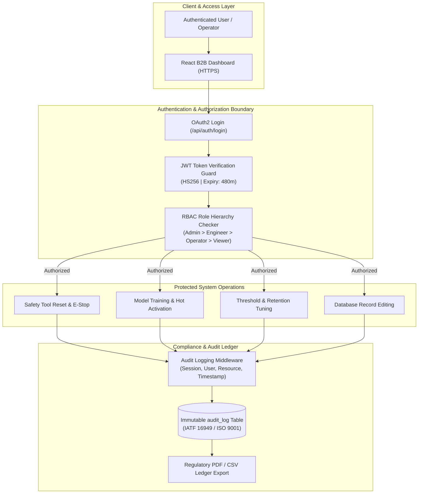

# Security, Role-Based Access Control (RBAC) & Auditability Specification

---

## 1. Security Architecture & Threat Model

In modern automotive powertrain, chassis, and battery pack manufacturing plants, assembly tools (electric DC nutrunners, robotic tightening spindles, press-fit actuators) operate directly on safety-critical fasteners. An unauthorized tool restart, an unvetted ML model activation, or an altered vibration trip threshold can lead to severe equipment damage, compromised joint clamp force, or worker injury.

The Aperture platform implements a **Defense-in-Depth** security framework protecting:
1. **Edge Ingestion Boundary**: Safeguards raw vibration telemetry streams against packet injection and payload tampering.
2. **Control & Decision Boundary**: Enforces cryptographically validated authentication before machine resets, emergency stops, or setpoint changes can be executed.
3. **Data & Audit Boundary**: Records an immutable, append-only ledger of every human intervention, model deployment, and configuration modification.



---

## 2. Authentication & Credential Lifecycle

### 2.1 Password Hashing Architecture
User passwords are never stored in plaintext or reversible formats. The system utilizes **Bcrypt** adaptive salting:
- **Work Factor (Cost)**: `12` iterations (`bcrypt.gensalt(rounds=12)`), ensuring resilience against GPU-accelerated dictionary and rainbow table attacks.
- **Salting Mechanism**: A unique, cryptographically random salt is generated for each password hash.

```python
def verify_password(plain_password: str, hashed_password: str) -> bool:
    try:
        return bcrypt.checkpw(plain_password.encode("utf-8"), hashed_password.encode("utf-8"))
    except Exception:
        return False

def get_password_hash(password: str) -> str:
    salt = bcrypt.gensalt()
    return bcrypt.hashpw(password.encode("utf-8"), salt).decode("utf-8")
```

### 2.2 JSON Web Token (JWT) Lifecycle
Upon successful credential validation at `/api/auth/login`, the backend issues a signed JSON Web Token:
- **Algorithm**: `HS256` (HMAC using SHA-256) keyed against `SECRET_KEY`.
- **Token Claims Payload**:
  ```json
  {
    "sub": "engineer",
    "role": "Engineer",
    "email": "engineer@aperture-auto.com",
    "exp": 1791244800,
    "iat": 1791216000
  }
  ```
- **Token Lifespan**: Configurable via `ACCESS_TOKEN_EXPIRE_MINUTES` (defaults to 8 hours matching standard plant shift rotations).
- **Client Handling**: Stored in application memory and transmitted across HTTPS via the standard `Authorization: Bearer <TOKEN>` header.

---

## 3. Role-Based Access Control (RBAC) Specification

The platform utilizes a strictly enforced role hierarchy where higher-privileged roles inherit all capabilities of subordinate roles:

```
Administrator  ──►  Engineer  ──►  Operator  ──►  Viewer
    (Tier 4)          (Tier 3)        (Tier 2)      (Tier 1)
```

### 3.1 Default Factory Accounts

| Role | Username | Default Password | Description & Scope |
| :--- | :--- | :--- | :--- |
| **Administrator** | `admin` | `admin123` | Plant technical superintendent. Full root permissions over user accounts, physical gateways, database retention, and station topology. |
| **Engineer** | `engineer` | `engineer123` | Manufacturing quality & AI reliability engineer. Trains ML models, tunes vibration thresholds, and performs tool interlock resets. |
| **Operator** | `operator` | `operator123` | Assembly line cell technician. Monitors active spindles, triggers physical emergency stops, executes explicit resets, and controls plant siren mute. |
| **Viewer** | `viewer` | `viewer123` | Production auditor / plant executive. Read-only live telemetry, historical shift reports, and audit ledger downloads. |

### 3.2 Granular Permissions Matrix

| Functional Capability | Viewer | Operator | Engineer | Administrator | Enforcing Endpoint / Guard |
| :--- | :---: | :---: | :---: | :---: | :--- |
| **View Live Telemetry & FFT Spectrum** |  Yes |  Yes |  Yes |  Yes | `GET /api/readings/latest`, `GET /api/vibration/live` |
| **View Historical Reports & CSV Exports** |  Yes |  Yes |  Yes |  Yes | `GET /api/history/features`, `GET /api/history/export` |
| **Actuate Siren Alert Mute Toggle** |  No |  Yes |  Yes |  Yes | Client Web Audio API Guard |
| **Actuate Emergency Stop (0 RPM Lockout)** |  No |  Yes |  Yes |  Yes | `POST /api/stations/{id}/emergency-stop` |
| **Execute Mandatory Tool Safety Reset** |  No |  Yes |  Yes |  Yes | `POST /api/stations/{id}/reset` |
| **Record & Export Dataset Sessions** |  No |  No |  Yes |  Yes | `POST /api/recordings/start`, `POST /api/recordings/stop` |
| **Train New AI ML Models (Isolation Forest)** |  No |  No |  Yes |  Yes | `POST /api/models/train` |
| **Hot-Activate Model Checkpoint** |  No |  No |  Yes |  Yes | `POST /api/models/{version}/activate` |
| **Tune Warn & Critical Safety Thresholds** |  No |  No |  Yes |  Yes | `PUT /api/models/{version}/thresholds` |
| **Direct Database Record Editing / Insert** |  No |  No |  Yes |  Yes | `PUT /api/recordings/database/*` |
| **Database Vacuum & Storage Retention Pruning**|  No |  No |  No |  Yes | `POST /api/database/cleanup`, `POST /api/database/vacuum` |
| **Configure Hardware BLE Gateways** |  No |  No |  No |  Yes | `POST /api/gateway/ble/vendor/config` |
| **User Management (Provision / Deprovision)** |  No |  No |  No |  Yes | `GET /api/admin/users`, `POST /api/auth/register` |
| **Modify Plant & Station Topology Hierarchy** |  No |  No |  No |  Yes | `POST /api/admin/hierarchy` |

---

## 4. Immutable Audit Ledger & Traceability Engine

Every state-altering operation produces a permanent entry in the `audit_log` database table. Audit rows cannot be edited or pruned via standard UI or API endpoints.

### 4.1 Audit Log Database Schema

```sql
CREATE TABLE audit_log (
    id INTEGER PRIMARY KEY AUTOINCREMENT,
    user_id VARCHAR NULL,
    username VARCHAR NOT NULL,
    action VARCHAR NOT NULL,
    resource VARCHAR NULL,
    details TEXT NULL,
    ts DATETIME DEFAULT CURRENT_TIMESTAMP
);
CREATE INDEX ix_audit_log_ts ON audit_log (ts);
```

### 4.2 Comprehensive Audited Actions Catalogue

| Action Code | Trigger Event | Resource Affected | Typical Details Recorded |
| :--- | :--- | :--- | :--- |
| `TOOL_RESET` | Operator clicks "Reset Tool" | `Station:station-A` | *"Interlock cleared by operator. Commanded speed set to 100% (1500 RPM)."* |
| `EMERGENCY_STOP`| E-Stop button actuated | `Station:station-A` | *"Manual Emergency Stop triggered from Live Monitoring. 0 RPM commanded."* |
| `MODEL_TRAINED` | Engineer retrains anomaly model | `Model:v1.4.0-tuned` | *"Trained IsolationForest on 450 normal and 210 disturbed windows. ROC-AUC: 0.984."* |
| `MODEL_ACTIVATED`| Checkpoint set as active engine | `Model:v1.4.0-tuned` | *"Active ML inference engine switched from v1.3.0 to v1.4.0-tuned."* |
| `THRESHOLDS_UPDATED`| Anomaly trip limits modified | `Model:v1.4.0-tuned` | *"Warn threshold: 0.45 -> 0.40, Critical threshold: 0.70 -> 0.65."* |
| `FEATURE_UPDATED`| Inline database edit on feature | `FeatureRecord:#104` | *"RMS updated from 0.125g to 0.145g by engineer."* |
| `FEATURE_DELETED`| Feature row deleted | `FeatureRecord:#88` | *"Record #88 deleted from features table."* |
| `FEATURE_CREATED`| Manual feature record inserted | `FeatureRecord:#125` | *"Manual feature insertion: RMS: 0.250g, Peak: 0.550g, Dominant Freq: 60Hz."* |
| `DECISION_UPDATED`| Safety decision record modified | `DecisionRecord:#42` | *"Decision #42 state updated from WARNING to NORMAL."* |
| `DB_CLEANUP` | Storage retention purge run | `Database:SQLite` | *"Purged telemetry older than 1_month. Reclaimed 24.5 MB via VACUUM."* |
| `GATEWAY_UPDATED`| BLE Gateway API config saved | `Gateway:gw-ble-01` | *"Updated API URL to vendor Cloud Run endpoint; poll interval: 1.0s."* |
| `SETTINGS_SAVED`| System / branding updated | `Settings:Global` | *"Updated company name to 'Aperture Auto', timezone to 'UTC+05:30'."* |

### 4.3 Real-Time Streaming & Regulatory Export

The Audit View module (`/audit`) provides:
1. **Live Stream Poller**: Continuously polls new audit entries every 2.5 seconds, ensuring plant supervisors observe operator actions in real time.
2. **One-Click CSV Export**: Formats the complete chronological event sequence for external spreadsheet analysis.
3. **Automotive Regulatory PDF Ledger**: Generates a cryptographically structured, publication-grade document formatted with corporate branding, station IDs, exact timestamps, and operator signatures for compliance review.

---

## 5. Automotive Quality Standards Compliance

The architecture directly addresses stringent automotive manufacturing standards required by major automotive OEMs and Tier 1 suppliers.

```
+----------------------------------------------------------------------------------------------------+
|                             AUTOMOTIVE QUALITY STANDARDS MAPPING                                   |
+----------------------------------------------------------------------------------------------------+
| STANDARD      | CLAUSE / SECTION      | PLATFORM COMPLIANCE MECHANISM                              |
+----------------------------------------------------------------------------------------------------+
| IATF 16949    | 7.1.5.2 (Traceability)| Every sensor window, FFT feature, and anomaly score is     |
|               |                       | indexed to a station, timestamp, and device MAC address.   |
+----------------------------------------------------------------------------------------------------+
| IATF 16949    | 8.5.1.1 (Control Plan)| Autonomous deceleration and E-Stop lockouts enforce safety |
|               | & Error-Proofing      | interlocks preventing defective fastener assemblies.       |
+----------------------------------------------------------------------------------------------------+
| IATF 16949    | 10.2.3 (Problem       | Full vibration FFT spectra and persistence reasons are     |
|               | Solving / RCA)        | persisted during safety trips for rapid root-cause inquiry.|
+----------------------------------------------------------------------------------------------------+
| ISO 9001:2015 | 7.5 (Documented Info  | Immutable audit_log records identity, timestamp, and       |
|               | & Integrity)          | action for every parameter change or tool reset.           |
+----------------------------------------------------------------------------------------------------+
| ISO 9001:2015 | 8.5.1 (Production &   | Strict RBAC ensures only qualified Engineers and Admins    |
|               | Service Control)      | can alter thresholds, retrain models, or prune databases.  |
+----------------------------------------------------------------------------------------------------+
| IEC 62443     | SR 1.1 - SR 2.1       | Strong password hashing, JWT bearer token expiration, and  |
| (Industrial)  | (Access Control)      | zero-trust separation of Viewer/Operator/Admin roles.      |
+----------------------------------------------------------------------------------------------------+
```

---

## 6. Safety Interlock & Reset Authentication Protocol

A critical requirement of industrial machine protection is preventing **uncontrolled automatic restarts** after a tool has tripped due to mechanical resonance or shock:

```
[Tool Vibrates Severely]
         │
         ▼
[State Trips to STOPPED] ──► [Motor Commanded 0 RPM] ──► [Audio Siren Wail Active]
         │
         ▼
[Vibration Subsides to 0.0g]
         │
         ▼
[Machine Remains Locked in STOPPED] (Auto-Restart Prohibited by State Machine)
         │
         ▼
[Operator Inspects Tool & Spindle]
         │
         ▼
[Operator Authenticates & Clicks "Reset Tool"]
         │
         ├── JWT Role Verified: Must be Operator, Engineer, or Admin
         ├── Action Recorded: "TOOL_RESET" logged with User ID & Timestamp
         └── Motor Energized: Reset dispatched -> Commanded Speed 100% -> Beacon Green
```

### Safety Policy Guarantees
1. **No Auto-Clearing**: Even if the mechanical disturbance immediately vanishes, the tool remains locked in `STOPPED` ($0\text{ RPM}$) until an explicit reset is received.
2. **Operator Attribution**: Anonymous or unauthenticated resets are strictly rejected; the system records the exact operator username responsible for re-energizing the spindle.
3. **Emergency Stop Precedence**: The manual Emergency Stop button commands immediate physical de-energization and overrides any ongoing automated sequence.
